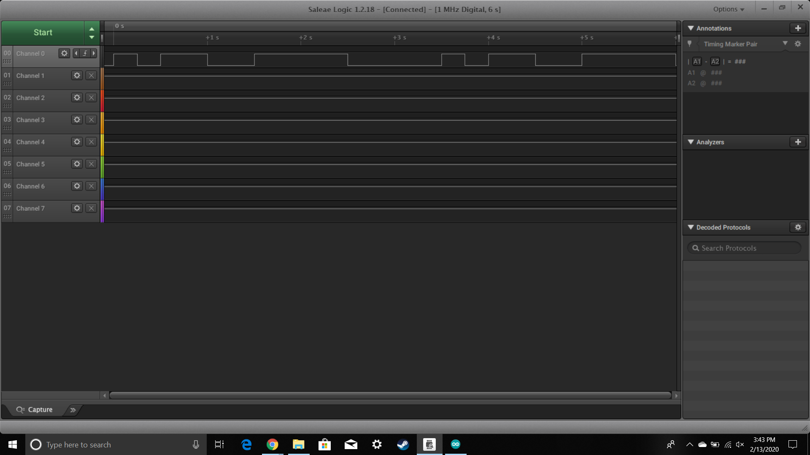
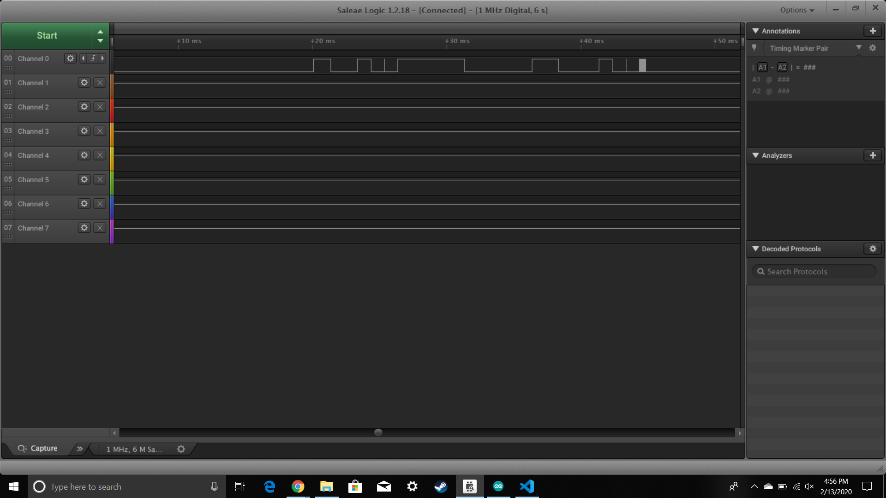
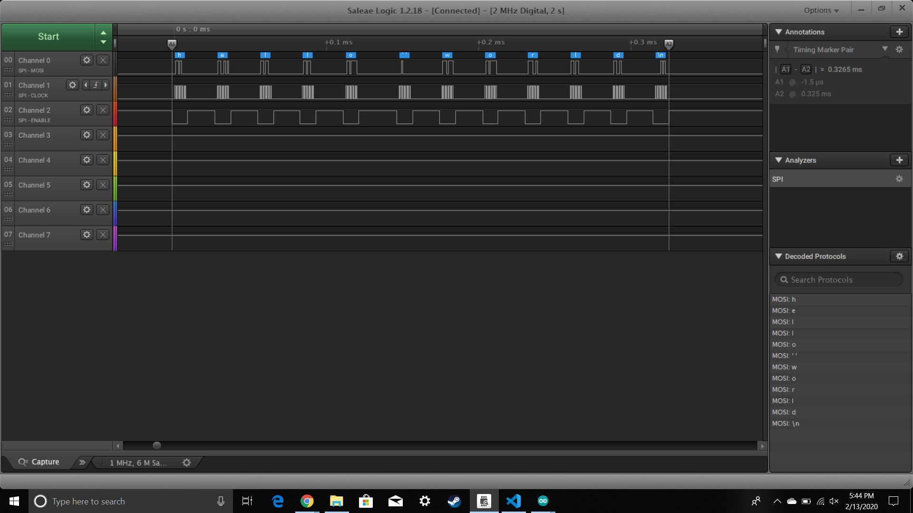

Name: Diego Davila

EID: dpd633

Team Number: F6

## Questions

1. Why does your program need a setup and a loop?

    The program needs a set up to create and initalize variables and it needs a loop to perform the desired function

2. What is the downside to putting all your code in a loop?

    You'll repeat initalization, which can change variables.

3. Why does your code need to be compiled?

    So that your code can be translated into machine language that the chip can understand.

4. When lowering the frequency in procedure A, step 4, what is going wrong? Brainstorm some solutions. Dimmers exist in the real world. What is their solution?

    The LED is blinking is too fast for the human eye to see, so the solution is to raise the frequency so that the eye can catch the dimming effect.

5. Why do you need to connect the logic analyzer ground to the ESP32 ground?

    The ESP32 and logic analyzer need to be set to the same ground so that they are at the same base line.

6. What is the difference between synchronous and asynchronous communication?

    Synchronous ou know when the data is coming in (clock is high), but with asynchronous you do not know when the data is coming and its constantly looking for data when there can potentially be no data.

7. Profile of UART: Sent X bytes in Y time 

    12 bytes in 1.031 ms

8. Profile of SPI: Sent X bytes in Y time

    Sent 12 bytes in 0.3265ms

9. Why is SPI so much faster than UART?

    Because the clock rate of SPI is faster than UART's.

10. list one pro and one con of UART

    You need less wires than SPI if you use UART, but UART is slower than SPI.

11. list one pro and one con of SPI

    SPI is faster than UART, but SPI requires more wires than UART.

12. list one pro and one con of I2C

    I2C only requires two wires and can support multiple slaves, but the lines are open drain and require pull up or pull down resistors. 

13. Why does I2C need external resistors to work?

    Because the lines are open drain. 

## Screenshots

Procedure A, step 1:

Procedure A, step 4:

Procedure B, UART:

Procedure B, SPI:

